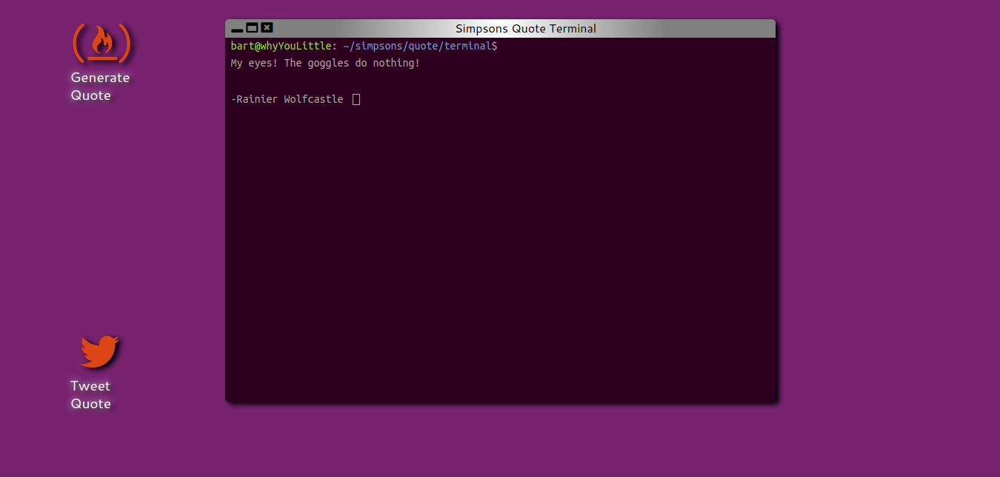

# Simpsons Quote Terminal
> Random quote generator connecting to a Simpsons quote API made to look like a Ubuntu terminal. Live demo available at https://jaredcaraway.github.io/simpsons-quote-terminal/.

This is a browser-based app I originally created while going through the freeCodeCamp curriculum. Simpsons quotes are delivered via [Jason Luboff's Simpsons Quote API](https://thesimpsonsquoteapi.glitch.me).

## How to Use

This app is incredibly simple! 

1. Pull up the live demo. 
2. To generate a quote, you simply click on the icon that says (wait for it!) "Generate Quote." The API server seems to shut down if it's not pinged for a while, so you may have to try a couple of times before you get a quote response.
3. Once the quote is displayed, a "Tweet Quote" button appears which allows you to - that's right! - tweet the quote.

## Release History

* 0.0.1
    * Initial release

## Developing Locally

This project uses Sass (SCSS syntax), BrowserSync for live preview functionality, and Gulp to stitch everything together. You'll want to have Node and Yarn (my preferred package manager) or NPM installed.

First clone this repo to your machine. Then, installing the dependencies should be as simple as running `yarn install` or `npm install`.

When I'm working on this project, I run `gulp watch`; this will watch the index.html file, compile SCSS changes on the fly, and update the output live via BrowserSync.

## Contributing

In its current iteration, there are a number of bugs to be worked out and improvements to be made. Contributions to this project are more than welcome! Here's how to contribute:

1. Check the [Issues](https://github.com/jaredcaraway/simpsons-quote-terminal/issues) page for a list of known bugs and suggested improvements. (If you want to contribute something else, please go ahead and open a new issue first.)
1. Fork it!
1. Create your feature branch (`git checkout -b feature/fooBar`).
1. Commit your changes (`git commit -am 'Add some fooBar'`).
1. Push to the branch (`git push origin feature/fooBar`).
1. Create a new pull request.

That's it! All contributors will get a mention in this readme. (As of now, I am the sole contributor.)
